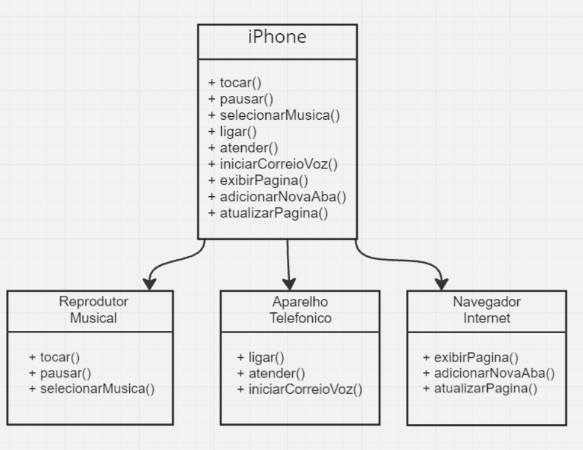

# Modelando iPhone com UML

### Ferramentas Utilizadas:
- **Miro**: Modelagem do diagrama das interfaces e da classe responsável pela chamada dos métodos das interfaces.

### Projeto proposto pela DIO

Criar um diagrama UML de um componente do iPhone abrangendo suas funcionalidades como Reprodutor Musical, Aparelho Telefônico e Navegador na Internet.

